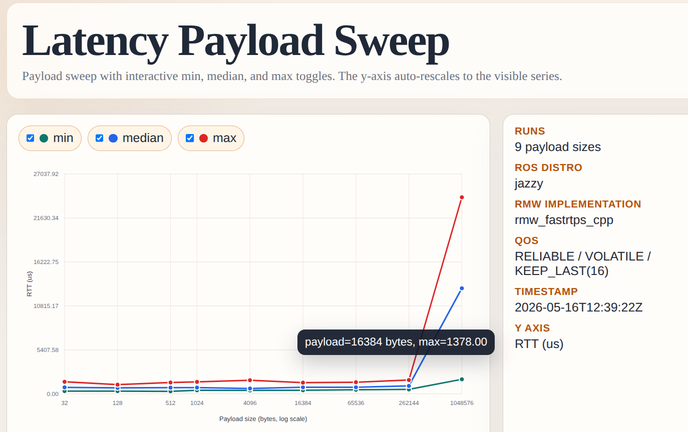

# ros2-perf

The performance benchmark and plotting tool for ROS 2



## Build

```shell
git clone https://github.com/evshary/ros2-perf.git
colcon build --symlink-install --cmake-args -DCMAKE_BUILD_TYPE=Release -DCMAKE_EXPORT_COMPILE_COMMANDS=ON
source install/setup.bash
```

## Latency

* Terminal 1: Run pong

```shell
ros2 run perf pong
# Run without info
ros2 run perf pong --ros-args --log-level warn
# Run with QoS
ros2 run perf pong --ros-args -p reliability:=BEST_EFFORT -p durability:=TRANSIENT_LOCAL -p history:=KEEP_ALL
```

* Terminal 2: Run ping

```shell
ros2 run perf ping
# Run without info
ros2 run perf ping --ros-args --log-level warn
# Run with QoS
ros2 run perf ping --ros-args -p reliability:=BEST_EFFORT -p durability:=TRANSIENT_LOCAL -p history:=KEEP_ALL
# Other configuration
ros2 run perf ping --ros-args -p warmup:=5.0 -p size:=32 -p samples:=100 -p rate:=10
```

## Throughput

* Terminal 1: Run throughput sender

```shell
ros2 run perf throughput_send
# Run without progress logs from ROS
ros2 run perf throughput_send --ros-args --log-level warn
# Sender payload configuration
ros2 run perf throughput_send --ros-args -p size:=1048576
# Run with QoS
ros2 run perf throughput_send --ros-args -p reliability:=BEST_EFFORT -p durability:=TRANSIENT_LOCAL -p history:=KEEP_ALL
```

* Terminal 2: Run throughput receiver

```shell
ros2 run perf throughput_recv
# Run without progress logs from ROS
ros2 run perf throughput_recv --ros-args --log-level warn
# Receiver timing configuration
ros2 run perf throughput_recv --ros-args -p warmup:=5.0 -p running_time:=10.0
# Run with QoS
ros2 run perf throughput_recv --ros-args -p reliability:=BEST_EFFORT -p durability:=TRANSIENT_LOCAL -p history:=KEEP_ALL
```

`running_time` is the measured throughput window after warmup.
The receiver exits after `warmup + running_time` seconds in total.

## Payload Sweep Plots

Run the built-in payload sweep for latency and generate `latency.html`:

```shell
ros2 launch perf latency.launch.py
```

Run the built-in payload sweep for throughput and generate `throughput.html`:

```shell
ros2 launch perf throughput.launch.py
```

Both launch files create a timestamped directory under `benchmark_results/` in the current
working directory. Each run directory contains the raw JSON results for every payload size and
the generated self-contained HTML plot.

## Troubleshooting

If a launch run is interrupted, old benchmark processes may still be running and can affect the
next sweep. Clean them before retrying:

```shell
pkill -f 'install/perf/lib/perf/throughput_send'
pkill -f 'install/perf/lib/perf/throughput_recv'
pkill -f 'ros2 run perf throughput_send'
pkill -f 'ros2 run perf throughput_recv'
pkill -f 'install/perf/lib/perf/pong'
pkill -f 'ros2 run perf pong'
```
